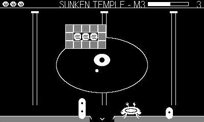

# Molt

> Part of **[plAIdate](https://plaidate.github.io)** — AI-built 1-bit games, ports, and engines for the Playdate.

An arkanoidvania for Playdate. You are a crab; your carapace is the
paddle. Bounce a pearl to smash coral across a connected undersea world,
molt new shells to open the way, and face the myths of the deep.

*Complete and playable start to finish: 28 rooms across six zones, five
molt abilities, seven bosses, a Kraken finale. All 1-bit, all synth.*

New to the deep? Read the **[player's manual](MANUAL.md)**.

## Play it

Grab a prebuilt `Molt.pdx.zip` from the [Releases](../../releases) page
(or the `dist/` folder), then sideload it at
<https://play.date/account/sideload/> — or unzip it and open the `.pdx`
in the Playdate Simulator. To build from source instead, see
[Development](#development).

## Controls

| Input | Action |
| --- | --- |
| d-pad ←/→ | scuttle (walk off an edge to leave the room) |
| d-pad ↑ | ride a bubble vent up |
| d-pad ↓ | burrow into the sand / descend a sand gap |
| A | serve the pearl / Pincer Snap when it's loose |
| B hold | Sticky Claw catch |
| B tap | world map |
| crank | aim serves; crank during a bounce for english |
| (docked) | fixed 45° serves — fully playable |

## How it works

- Where the pearl hits your shell sets the exit angle. Missing it costs
  a shell heart; at zero you molt back to the last rest anemone.
  Anemones heal and save. Serving is always free.
- Every boss guards a molt: **Pincer Snap** cuts kelp curtains and
  super-shots a falling pearl; **Sticky Claw** catches for aimed
  re-serves; **Heavy Pearl** shatters stone; the **Lantern Snail**
  lights the Abyss; **Anchor Legs** defy the deep currents.
- Gate blocks stay broken forever, and boss wounds persist — leave a
  fight and come back where you left it.
- Four shell shards grow a heart (up to six). Three temple keys, hidden
  behind backtracks, break the glyph door to the Sunken Temple.
- The sea is inhabited: jellyfish, pufferfish, starfish repair crews,
  urchins, barnacle turrets, sprat shoals, ghost fish in the dark, and
  a moray eel that will swallow your pearl — snap its nose to get it
  back. Creatures stun, never wound.

## The seven guardians

Old Hermit (bottle armor) · Kelpie (gallops the ceiling, sows kelp) ·
Siren (charms the pearl while her choir stands) · Umibōzu (strike the
eyes between waves of dark) · Charybdis (feed it powder kegs) ·
Hippocampus (a jousting knight) · **the Kraken** (three phases; its
tentacles are rival paddles).

## Development

    make            # release build -> out/Molt.pdx
    make smoke      # instrumented build -> out/MoltSmoke.pdx
    tools/smoke.sh 1500 '"phase":"cruise"'   # full-game verification

The smoke autopilot beats the entire game: every molt earned from its
boss, every gate and refusal exercised, all three keys via backtracks,
every creature verified, glyph door, Hippocampus, Kraken, a deliberate
death (anemone respawn), then endless cruise. It navigates by BFS over
the room graph, aims bounces by offsetting the intercept, and recovers
from deaths mid-errand. Heartbeat counters land in `results/smoke.json`;
frame-stamped screenshots in `build/shots/`.

Music is a clock-driven 16-step synth sequencer — one motif per zone,
a driving boss variant (toggle in the system menu).
